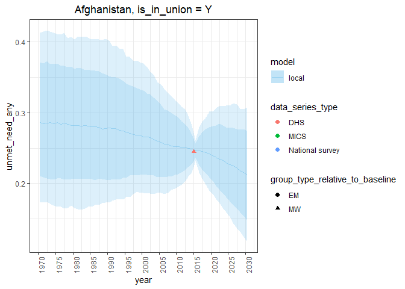
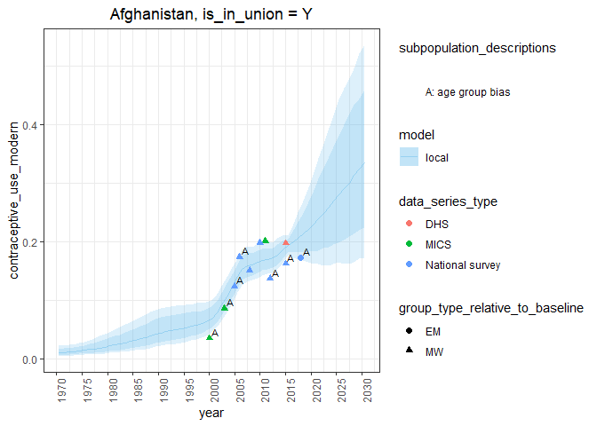

FPEMlocal
================

<!-- badges: start -->

<!-- add new release the one below is old -->

<!--  [](https://doi.org/10.5281/zenodo.3899454) -->

<!-- badges: end -->

## Installation

The package can be installed by cloning and using `devtools::install()`.
The source code for vignettes can be found in
[/vignettes](https://github.com/FPcounts/FPEMlocal/tree/master/vignettes).
Below is a brief introduction.

## Introduction

The FPEMlocal package is the one-country implementation of FPEM (family
planning estimation model) designed with tidyverse philosophy. The model
in this package uses global model results from the package FPEMglobal to
aid in the estimation of country level family planning indicators.
FPEMlocal comes equiped with survey data, country unit data, and country
population count data, to produce one-country runs. Running FPEM is
divided into three main functions.

1.  [Fit a one country model](#fit) `fit_fp_c`
2.  [Calculate family planning indicators](#results) `clac_fp_c`
3.  [Plot the family planning estimates against the survey data](#plot)
    `plot_fp_c`

These three functions make running one country FPEM straightforward,
while retaining enough division to carry out a variety of developer and
client tasks. In this document we will cover the typical use of these
three functions.

To start a run we need to know the country code for the country of
interest. Our package contains country codes and other country units in
the dataset `divisions`.

``` r
divisions %>% head
```

    ## # A tibble: 6 x 13
    ##   division_numeri~ name_country name_region name_sub_region region_numeric_~
    ##              <dbl> <chr>        <chr>       <chr>                      <dbl>
    ## 1                4 Afghanistan  Asia        South-Central ~              935
    ## 2                8 Albania      Europe      Southern Europe              908
    ## 3               12 Algeria      Africa      Northern Africa              903
    ## 4               16 American Sa~ Oceania     Polynesia                    909
    ## 5               20 Andorra      Europe      Southern Europe              908
    ## 6               24 Angola       Africa      Middle Africa                903
    ## # ... with 8 more variables: sub_region_numeric_code <dbl>,
    ## #   is_developed_region <chr>, is_less_developed_region <chr>,
    ## #   is_least_developed_country <chr>, is_in_sub_saharan_africa <chr>,
    ## #   is_unmarried_sexual_activity <chr>, is_low_population <chr>,
    ## #   is_fp2020 <chr>

Our package data sets are tibbles. The country codes used by our
package, known as `division_numeric_code`, are found in this data. In
our example we will execute a one-country run for Afghanistan, code `4`.
Survey data is available in the dataset `contraceptive_use`. See
`??contraceptive_use` for a detailed description of this dataset.

## <a name="fit"></a>

## 1\. Fit a one country model

`fit_fp_c` is a wrapper function to fit the one-country implementation
of the family planning estimation model. There are two versions of this
model, one for in-union and another for not-in-union women which can be
specified with the argument `is_in_union`. These are denoted `"Y"` and
`"N"` respectively. The first\_year and last\_year arguments determine
the years of estimates exported from the run. Regardless of these
arguments, the function will use all years in which data is available
for estimation. When a survey file is not provided, as in this example,
the function uses default package contraceptive\_use. The user may also
supply optional services statistics.

``` r
fit <- fit_fp_c(
  is_in_union = "Y",
  division_numeric_code = 231,
  first_year = 1970,
  last_year = 2030,
  diagnostic = TRUE
)
```

## <a name="results"></a>

## 2\. Calculate point estimates for indicators

`fpet_calculate_indicators` is a wrapper function for calculating point
estimates and confidence intervals. By default the function uses package
population data (See `population_counts`) in order to calculate family
planning indicators. Custom population count data may be supplied (See
`??fpet_get_results`).

``` r
results <- calc_fp_c(fit)
```

## <a name="plot"></a>

## 3\. Plot the point estimates against the survey data

`plot_fp_c` plots the results of the model against the survey data. The
user supplies the objects exported from `fit_fp_c` and
`fpet_calculate_indicators` as well as indicators of interest.
Indicators of interest are supplied to the argument `indicators`. The
argument `compare_to_global` adds point estimate and 95% credible
interval from the UNPD global model (See `global_estimates`). The global
model estimates are plotted using dotted lines. Since we are only using
the default data from UNPD the estimates from our model should align
with the UNPD estimates.

``` r
plot_fp_c(
  fit,
  results,
  indicators = c(
    "unmet_need_any",
    "contraceptive_use_modern",
    "contraceptive_use_traditional",
    "contraceptive_use_any"
    ),
  compare_to_global = FALSE
)
```

    ## $Y
    ## $Y$unmet_need_any

<!-- -->

    ## 
    ## $Y$contraceptive_use_modern

<!-- -->

    ## 
    ## $Y$contraceptive_use_traditional

<!-- -->

    ## 
    ## $Y$contraceptive_use_any

<!-- -->
